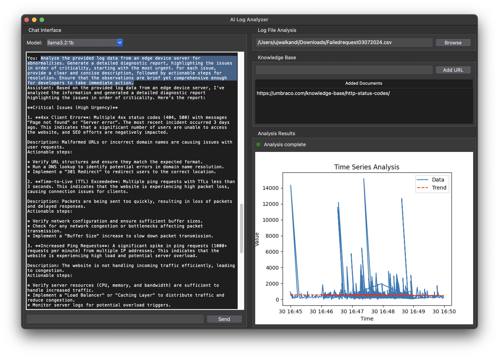

### A.I.D.E. - AI Diagnostic Engine

<!-- Image with responsive width and auto aspect ratio -->

**Overview:**  
A.I.D.E. is an AI-driven solution that revolutionizes observability and troubleshooting in distributed environments. It helps with the initial analysis of on-device logs, providing rapid insights into potential issues and equipping support and development teams with actionable information before they intervene.

<!-- Image with responsive width and auto aspect ratio -->

**Key Features:**  
- **AI-Powered Log Analysis:** Automatically parses and interprets logs, detecting anomalies and offering clear diagnostic reports to expedite issue identification.  
- **Developer Productivity Tools:** Goes beyond diagnostics by answering developers’ questions about the root cause of issues, providing guided solutions, and recommending fixes.  
- **Integrated Knowledge Sources:** Leverages external resources such as technical documentation and coding forum discussions to deliver well-informed, contextually relevant support.  
- **On-Device Versatility:** Designed to address diverse use cases across distributed systems, ensuring seamless operation even in resource-constrained environments.  

**Impact:**  
A.I.D.E. accelerates troubleshooting, enhances developer efficiency, and reduces downtime, making it an essential tool for teams managing complex, distributed systems.
